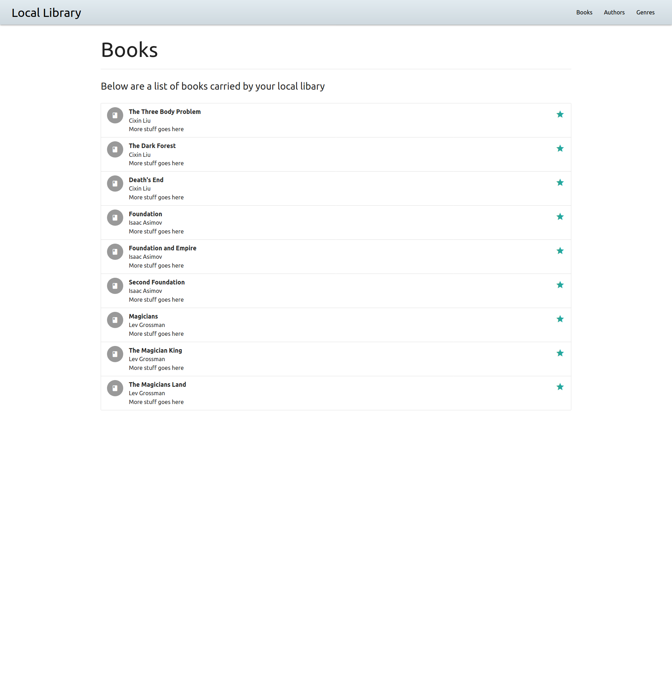

# Mozilla Developer Network - Django Rest Framework - Vue.js

Whenever I am trying to learn a new element of web development in my full-stack journey, I like to have a well defined and not-too-trick project to base it on. For me, the Mozilla Developer Network [Django Tutorial](https://developer.mozilla.org/en-US/docs/Learn/Server-side/Django) was the best help in getting me to really understand the Django web framework. Because of this, I like to revisit it regularly as I try out different approaches to building web applications. In addition to learning new things each time I review it, I find it helps me to have a set project with clearly defined goals that are broken out into easily completed steps. For this repository I will be attempting to apply the following adjustments to the original tutorial project:

- Create/Use custom User object for Authentication/Authorization
- Use [Django REST Framework](https://www.django-rest-framework.org/) to expose a REST API rather than use built in templates
- Create a simple [Vue.sj](https://vuejs.org/) SPA front end to consume the REST API

## Organization

- backend/ - This is the Django project (wtih DRF) built by following the MDN Django tutorial (except making REST API endpoints instead of views/templates)
- frontend/ - This is the Vue.js SPA that will consume the backend server and render an interface for library patrons (staff use Django admin site)

## Vue Front End

I am _really_ basic in my Vue abilities at present so don't get your hopes up but I'm happy to be able to start quickly building out basic components that do the job I expect of them. I'm sure I'll start wanting a more cool and seamless UX that will spur greater development in that direction (I hope). For the time being, I'm just excited to get my list of books rendering like so:

### Potential Bonus Goal - Async Django Server

I'm not really sure how to do this or what the best way to implement it is (since it's pretty brand new) but since the current version of Django (3.0.7 at the time of this writing) includes support for both synchronous (WSGI) and asynchronous (ASGI) server processes, this might be a useful project in which to attempt to implement them. We should not let a single thread in a single core of our CPU sit idle when there are requests to process!

However, the documentation on this aspect is pretty thin, both on how to implement it and why you would want to, so I don't know if I'll get to it in this project.
